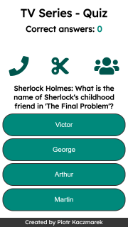
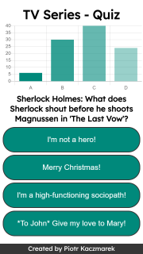
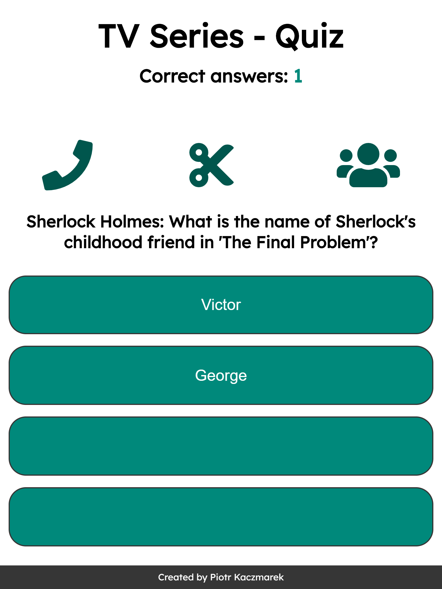

# TV series - QUIZ

> This project is a quiz application with made in Express.js and React.js

## Table of contents

- [General info](#general-info)
- [Screenshots](#screenshots)
- [Technologies](#technologies)
- [Setup](#setup)
- [Contact](#contact)

## General info

It was created based on the course on Udemy.com 'Node.js, Express i MongoDB' by Samuraj Programowania.

## Screenshots

There are few media queries included in this app.





## Technologies

- React.js - version 16.9
- Express.js - version 4.17
- Chart.js - version 2.8
  - along with React-chartjs-2 version 2.7
- React-draggable - version 3.3.1

## Setup

In order to run this app you need [Node.js](https://nodejs.org/) v6+.

Install the dependencies for both back-end and front-end.

```sh
$ cd backend
$ npm i
$ cd ../frontend
$ npm i
```

Next you have to build a production version of front-end - because in this app I've connected front-end production version as source of static files for back-end.

```sh
$ npm run build //from frontend directory
$ cd ../backend
$ node app.js (or nodemon app.js if you are using nodemon)
```

Now you can run quiz in your browser using address `http://localhost:9000/`.

## Contact

Created by [Piotr Kaczmarek](piotrkaczmarek.dev@gmail.com) - feel free to contact!
